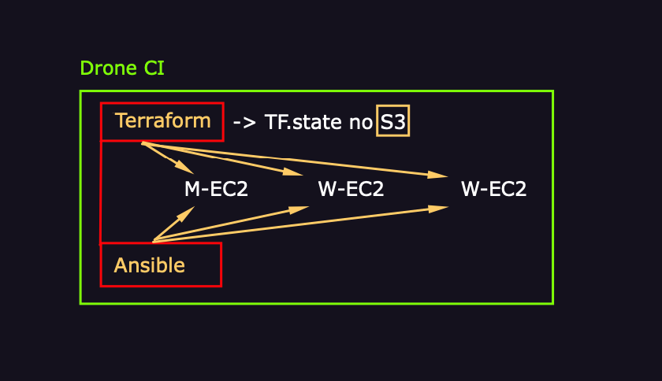

# Cluster K8S

Desenvolvido por [Mateus Muller](https://github.com/mateusmuller/k8s-cluster-spinup), esse projeto é uma reprodução para fins acadêmicos usando: Terraform, Ansible, Drone CI, Docker, Kubernetes e AWS.

<br><br><br>

# Arquitetura

Inicialmente 3 instâncias são configuradas pelo Terraform, com grupo de segurança e um par de chaves. O estado da aplicação(TF.state) será armazenado em um bucket na S3.

Logo em seguida a instalação e configuração do cluster é definida no site.yml e executada pelo Ansible.

Com tudo pronto, uma imagem é construida para ser executada pelo Drone CI, ele será responsavel por rodar todas as configurações definidas pelo Terraform e Ansible, tendo como resultado um cluster kubernetes.

# Execução

Para desenvolver este projeto, eu usei as aulas disponiveis no [youtube](https://www.youtube.com/watch?v=KqgMjMH3Gds&list=PL0zspxm7AK_BkrmF5vwdJy6XVVzwgrISP). Porém algumas configurações mudaram, e alguns ajustes foram feitos:

## - Hosts:

O primeiro desafio que encontrei foi na listagem dos hosts, o projeto original usa um script(`ec2.py`) para listar e informar para o playbook os hosts das maquinas criadas pelo Terraform na AWS. Porém recentemente foi disponibilzado o [plugin de inventário](https://docs.ansible.com/ansible/latest/collections/amazon/aws/aws_ec2_inventory.html) que traz informações detalhadas de cada instância criada. Por questões de adaptação eu resolvi usar o plugin ao ínves do script.

Para isso instalei o plugin:

```
ansible-galaxy collection install amazon.aws
```

E em seguida instalei os seus requesitos: `boto3` e `botocore` em uma imagem docker.
Logo em seguida criei o arquivo de configuração do ansible(`ansible.cfg`):

```
[defaults]
inventory = ./ansible_plugins
host_key_checking = False
pipelining = True
log_path = /var/log/ansible
roles_path = ./roles
forks = 1000
```

Criei o arquivo de configuração do plugin no arquivo: `./ansible_plugins/get_groups_instances_tag_k8s_aws_ec2` sendo escolha do nome, livre, mas o sufixo deve ser `_aws_ec2.yml`. O arquivo contém as seguintes informações:

```
plugin: aws_ec2
regions:
  - us-east-1

keyed_groups:
  - key: tags.type
  - key: tags.name

filters:
  instance-state-name: running
compose:
  ansible_host: public_ip_address

strict_permissions: False
```

Para ver o resultado da listagem basta executar:

```
ansible-inventory --graph
```

O resultado será algo parecido com isso:

```
@all:
  |--@_k8s:
  |  |--ec2-<Ip da maquina aqui>.compute-1.amazonaws.com
  |  |--ec2-<Ip da maquina aqui>.compute-1.amazonaws.com
  |  |--ec2-<Ip da maquina aqui>.compute-1.amazonaws.com
  |--@_master:
  |  |--ec2-<Ip da maquina aqui>.compute-1.amazonaws.com
  |--@_worker:
  |  |--ec2-<Ip da maquina aqui>.compute-1.amazonaws.com
  |  |--ec2-<Ip da maquina aqui>.compute-1.amazonaws.com
  |--@aws_ec2:
  |  |--ec2-<Ip da maquina aqui>.compute-1.amazonaws.com
  |  |--ec2-<Ip da maquina aqui>.compute-1.amazonaws.com
  |  |--ec2-<Ip da maquina aqui>.compute-1.amazonaws.com
  |--@ungrouped:
```

Para mais detalhes sobre cada instância use: `ansible-inventory --list --yaml`

O `keyed_groups` configurado dentro do arquivo `get_groups_instances_tag_k8s_aws_ec2` traz os hosts separados por grupos, sendo assim, basta colocar o nome de cada grupo como host em seu arquivo principal:

```
- name: Install k8s and docker packages
  become: yes
  hosts: _k8s # => @_k8s
  roles:
    - docker
    - k8s-all

  ...

```

Com essa configuraçõe é importante lembrar que o comando para iniciar deve ser alterado, o nova instrução para iniciar o playbook é:

```
ansible-playbook  && \
  --u ubuntu && \
  --ssh-common-args='-o StrictHostKeyChecking=no' && \
  --private-key ~/.ssh/id_rsa site.yml&& \
```

Você pode conferir com mais detalhes em: [clarusway.com](https://clarusway.com/ansible-working-with-dynamic-inventory-using-aws-ec2-plugin/) e [faun.pub](https://faun.pub/learning-the-ansible-aws-ec2-dynamic-inventory-plugin-59dd6a929c7f)<br><br>

## - Inicialização do cluster

<br>

Depois de ter configurado o ansible com as instancias criadas pelo terraform, encontramos um alguns problemas na incialização do clustes. O serviço `kubelete` não estava iniciando. Depois de um tempo observando percebi que o serviço não incia antes de configurar o plano de controle do Kubernetes(`kubectl init`), mas que era possivel ativar-lo em seguida.

Então para resolver esse problema encontrei na [documentação oficial](https://kubernetes.io/docs/tasks/administer-cluster/kubeadm/configure-cgroup-driver/) um modelo de configuração(`kubeadm-config.yaml`) para que o `kubelete` podesse funcionar normalmente:

```
# kubeadm-config.yaml
kind: ClusterConfiguration
apiVersion: kubeadm.k8s.io/v1beta3
kubernetesVersion: v1.21.0
---
kind: KubeletConfiguration
apiVersion: kubelet.config.k8s.io/v1beta1
cgroupDriver: systemd
```

Para funcionar, é necessário enviar esse arquivo de configuração para cada instância. Para fazer isso adicionanmos mais um passo no arquivos de tarefas:

```
- name: Copy Remote-To-Server (kubeadm-config.yaml)
  synchronize:
    src: ./kubeadm-config.yaml
    dest: /home/ubuntu
```

ATENÇÃO!

Para enviar o arquivo para cada instância, é obrigatório que o `rysnc` esteja adicionado em seu Dockerfile para fazer a instalação! Caso o contrario você vai encontrar uma mensagem semelhante a essa em seu pipeline:

```
Failed to find required executable rsync in paths:
/usr/local/sbin:/usr/local/bin:/usr/sbin:/usr/bin:/sbin:/bin"
```

Logo em seguida basta iniciar passando esse arquivo como parametro de configuração:

```
kubeadm init --config kubeadm-config.yaml
```
